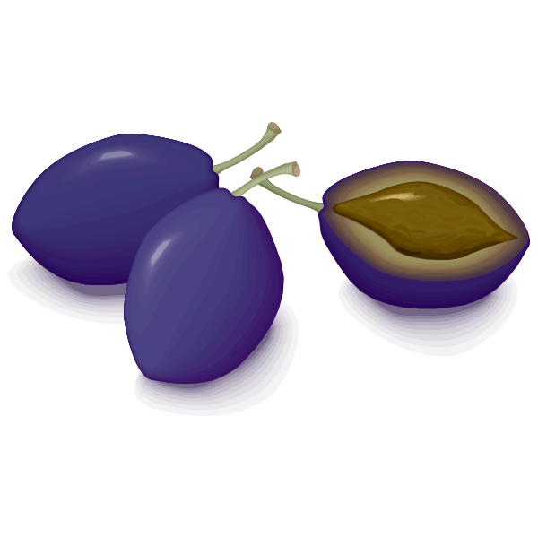

<p align="center">
  
</p>

# [Plum](http://hot-meal.github.io/plum/)

**Classless CSS**

## Introduction

Plum is the ideal CSS stylesheet for projects where you don't need a large CSS framework like Bootstrap. 

Just include plum.css and your page is good to go. No classes required. Just pure HTML.

## Key features

- Includes CSS reset styles.
- Fully responsive.
- Smart defaults for typography.
- Includes CSS for buttons, tables and form elements.
- Set it and forget it. No classes required in your HTML.


## Usage

Include the minified plum.min.css, that's all you need to do.


``` html

<!-- Latest compiled and minified CSS -->
<link rel="stylesheet" href="/css/plum.min.css">

```


